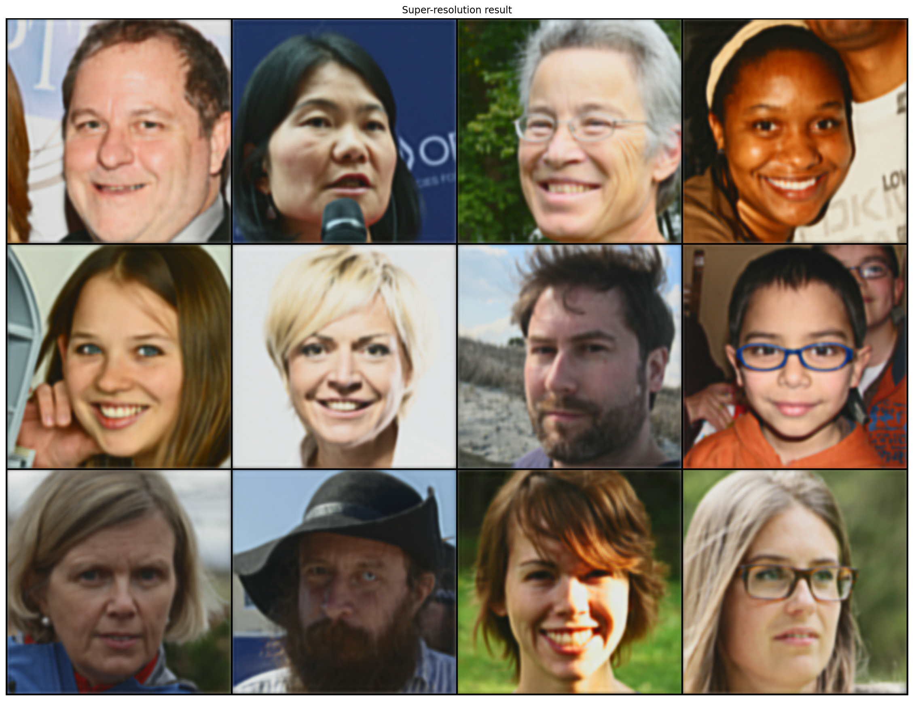
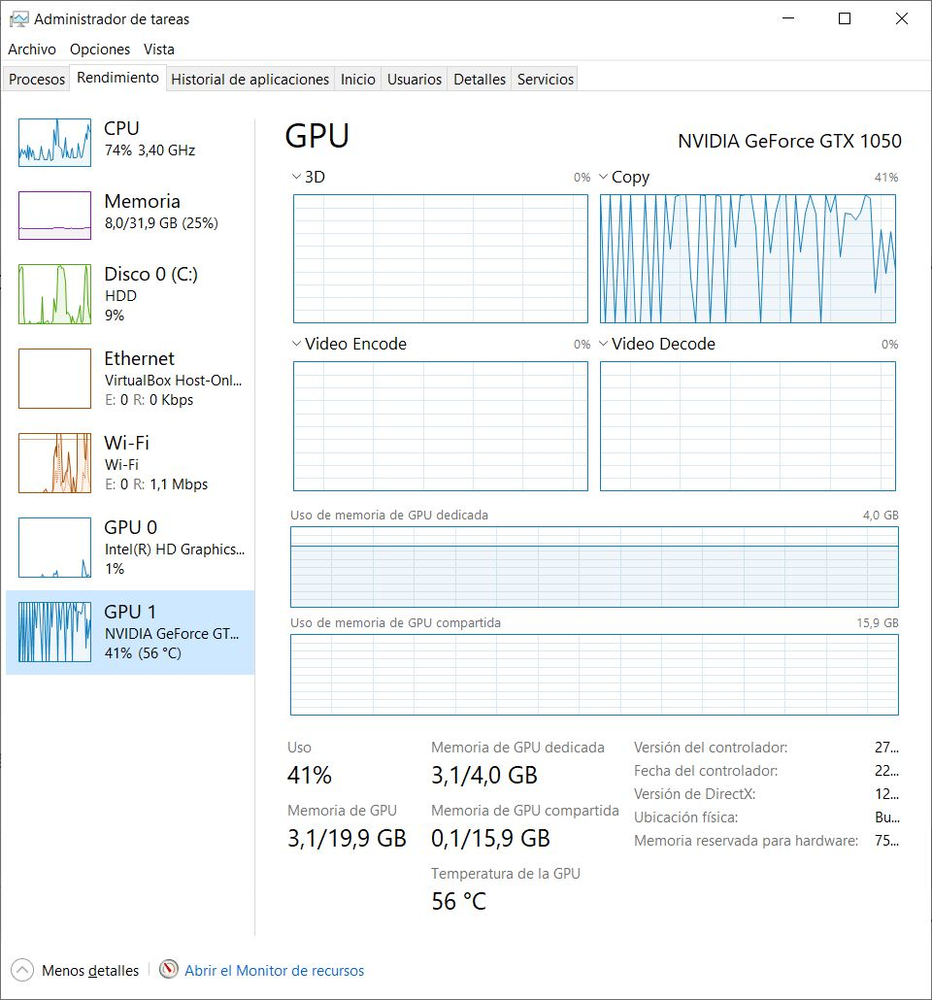
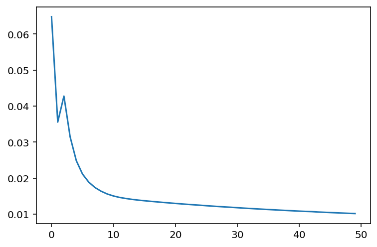

# Super-resolución 2x:
## Modelado y Entranamiento:

Ejercicio de curso para la asignatura de Computación Inteligente perteneciente al Máster Universitario en Sistemas Inteligentes y Aplicaciones Numéricas para la Ingeniería (MUSIANI) en el curso 2020/21, realizado por Juan Sebastián Ramírez Artiles.

El ejercicio consiste en implementar un método de superresolución en imágenes basado en el método VDSR descrito en el artículo [Superresolución de una sola imagen mediante el aprendizaje profundo](https://es.mathworks.com/help/images/single-image-super-resolution-using-deep-learning.html). Concretamente, en este notebook se ha implementado un escalado de dos aumententos. El dataset usado fue el [ffhq-dataset](https://drive.google.com/drive/folders/1u2xu7bSrWxrbUxk-dT-UvEJq8IjdmNTP) de libre descarga. Las imágenes usadas son las del conjunto 64000. En el dataset original las imágenes de alta resolución son de 1024x1024, y de 128x128 para las de baja resolución. Para la realización de este ejercicio se ha reducido las imágenes de alta resolución a 256x256 de modo que serán las que se usarán como etiquetas de la red. Con lo que se realizará un escalado de dos aumentos, de 128x128 a 256x256.





```python
%matplotlib inline
%config InlineBackend.figure_format = 'retina'
import matplotlib.pyplot as plt
import torch
from torchvision import datasets, transforms
from torch.utils.data import DataLoader, Dataset
import torch.nn.functional as F
import numpy as np
import torch.nn as nn
import torch.optim as optim
from os import listdir
from os.path import join
from PIL import Image
```

Las imágenes se cargan de cuatro directorios. Las imágenes reales se situan en train_y y valid_y, mientras que las imágenes a ampliar se encuentran en los directorios train_x y valid_x.

El programa se ejecutó en una máquina con un procesador Intel Core i7-7700HQ a 2.80GHz con una tarjeta de vídeo NVIDIA GeForce GTX 1050 de 4GB de memoria dedicada y con 32 GB de memoria RAM.




```python
ngpu = 1
beta1 = 0.5
lr = 0.005
bs = 150
epochs = 50

path_train_x = "faces/train_x/x8"
path_train_y = "faces/train_y/x4"

path_valid_x = "faces/valid_x/x8"
path_valid_y = "faces/valid_y/x4"
```

El entrenamiento del modelo se realizó únicamente en la capa de luminancia mientras que las capas de crominancia se escalaron por el método tradicional. El resultado final no se verá perjudicado en exceso, ya que las crominancias influyen mínimamente en la calidad del contorno. Para lograr este objetivo se hizo necesario convertir las imágenes de RGB a YCbCr.

Para la generación del dataset y las transformaciones del mismo se usó como modelo el ejemplo publicado en la web de pytorch [Writting custom datasets, dataloaders and transforms](https://pytorch.org/tutorials/beginner/data_loading_tutorial.html).


```python
class FacesDataset(Dataset):
    
    def __init__(self, root_dir_x, root_dir_y, transform=None):
        self.x_files = listdir(root_dir_x)
        self.y_files = listdir(root_dir_y)
        
        assert  len(self.x_files) == len(self.x_files)
        
        self.dir_x = root_dir_x
        self.dir_y = root_dir_y
        
        self.transform = transform

    def __len__(self):
        return len(self.x_files)

    def __getitem__(self, idx):
        if torch.is_tensor(idx):
            idx = idx.tolist()
                
        img_x = Image.open(join(self.dir_x, self.x_files[idx]))
        img_y = Image.open(join(self.dir_y, self.y_files[idx]))
                
        img_set = {'img_x': img_x, 'img_y': img_y}
        
        if self.transform:
            img_set = self.transform(img_set)

        return img_set
```


```python
class PilToYCbCr(object):
    def __call__(self, img_set):
        imgs = []
        
        for _, img in img_set.items():            
            imgs.append(img.convert('YCbCr'))
            
        return {'img_x': imgs[0], 'img_y': imgs[1]}
```


```python
class ToTensor(object):
    def __call__(self, img_set):
        
        imgs = []
                
        for _, img in img_set.items():
            tr = transforms.ToTensor()
            imgs.append(tr(img))
        
        return { 'img_x': imgs[0], 'img_y': imgs[1] }
```


```python
class Normalize(object):
    def __call__(self, img_set):
        imgs = []
        mean = torch.Tensor([0.5])
        std = 0.5
        
        for _, img in img_set.items():
            
            img = (img - mean.expand_as(img)) / std
            imgs.append(img)
        
        return {'img_x': imgs[0], 'img_y': imgs[1]}
```


```python
transform = transforms.Compose([
    PilToYCbCr(),
    ToTensor(),
    Normalize()
])

imgs_train = FacesDataset(path_train_x, path_train_y, transform = transform)
imgs_valid = FacesDataset(path_valid_x, path_valid_y, transform = transform)
```


```python
imgs_train_dl = DataLoader(imgs_train, batch_size = bs, shuffle = True)
imgs_valid_dl = DataLoader(imgs_valid, batch_size = bs, shuffle = True)
```

El dataset se dividió en 900 imágenes para entrenamiento y 100 imágenes para validación.


```python
print(len(imgs_train))
print(len(imgs_valid))
```

    900
    100
    


```python
device = torch.device("cuda:0" if (torch.cuda.is_available() and ngpu > 0) else "cpu")
```

Se probaron una variedad de modelos diferentes. Se usaron kernels de 3x3, de 5x5 y de 7x7, siendo estos últimos los que mejor resultados dieron. También se probaron diferentes configuraciones de red, añadiendo capas convolutivas y modificando las funciones de activación. Esta configuración resultó la más adecuada.

En el proceso de entrenamiento se usaron gran variedad de combinaciones de tamaños de batches y de cantidad de épocas. Se empezó con tamaños de batch de 8, se fue subiendo hasta 150, dejando todavía 900 MB de espacio en GPU. En cuanto al número de épocas, se empezó con 10 iteraciones y se fue subiendo hasta la cantidad de 80. No obstante, al variar el learning rate se aceleró la convergencia, con lo que finalmente se bajó a 50 épocas.


```python
class SuperResolution(nn.Module):
    def __init__(self):
        super().__init__()
        
        self.conv1 = nn.Conv2d(1, 8, kernel_size = 7, padding = 3)
        self.conv2 = nn.Conv2d(8, 16, kernel_size = 7, padding = 3)
        self.conv3 = nn.Conv2d(16, 8, kernel_size = 7, padding = 3)
        self.conv4 = nn.Conv2d(8, 1, kernel_size = 7, padding = 3)
        
        self.upsample = nn.Upsample(scale_factor = 2)

    def forward(self, xb):
        
        xb = self.upsample(xb)
        xb = torch.tanh(self.conv1(xb))
        xb = torch.tanh(self.conv2(xb))
        xb = torch.tanh(self.conv3(xb))
        
        return torch.tanh(self.conv4(xb))
```


```python
def preprocess(x, y):
    return x.to(device), y.to(device)
```


```python
def get_model():
    model = SuperResolution().to(device)
    return model, optim.SGD(model.parameters(), lr=lr, momentum=0.9)

loss_func = nn.MSELoss(reduction='mean')
```


```python
class WrappedDataLoader:
    def __init__(self, dl, func):
        self.dl = dl
        self.func = func
    
    def __len__(self):
        return len(self.dl)

    def __iter__(self):
        for sample_batch in imgs_train_dl:
            yield (self.func(sample_batch['img_x'][:,0].unsqueeze(-3), sample_batch['img_y'][:,0].unsqueeze(-3)))        
```


```python
def loss_batch(model, loss_func, xb, yb, opt=None):
    loss = loss_func(model(xb), yb)
    if opt is not None:
        loss.backward()
        opt.step()
        opt.zero_grad()
    
    return loss.item(), len(xb)
```


```python
def fit(epochs, model, loss_func, opt, train_dl, valid_dl, val_losses):
    for epoch in range(epochs):
        model.train()
        for xb, yb in train_dl:
            loss_batch(model, loss_func, xb, yb, opt)

        model.eval()
        with torch.no_grad():
            losses, nums = zip(
                *[loss_batch(model, loss_func, xb, yb) for xb, yb in valid_dl]
            )
        val_loss = np.sum(np.multiply(losses, nums)) / np.sum(nums)
        val_losses.append(val_loss)
        
        print(epoch, val_loss)
```


```python
train_dl = WrappedDataLoader(imgs_train, preprocess)
valid_dl = WrappedDataLoader(imgs_valid, preprocess)

val_losses = []

model, opt = get_model()
fit(epochs, model, loss_func, opt, train_dl, valid_dl, val_losses)
```

    0 0.06483114262421925
    1 0.035555280124147735
    2 0.0427752248942852
    3 0.03147281768421332
    ...
    ...
    47 0.010295956550786892
    48 0.010223751422017813
    49 0.010162690499176582
    

Se puede observar en el gráfico que la red aprende bien.


```python
plt.plot(val_losses)
plt.show()
```





Para finalizar, salvo el modelo para poder usarlo en el notebook [SR_Restore_Faces_Model.ipynb](SR_Restore_Faces_Model.md) que se encargará de escalar las 100 imágenes de validación. - Modelo entrenado [SR_model_Faces_5.0.ml](SR_model_Faces_5.0.ml) -


```python
torch.save(model, "SR_model_Faces_5.0.ml")
```
